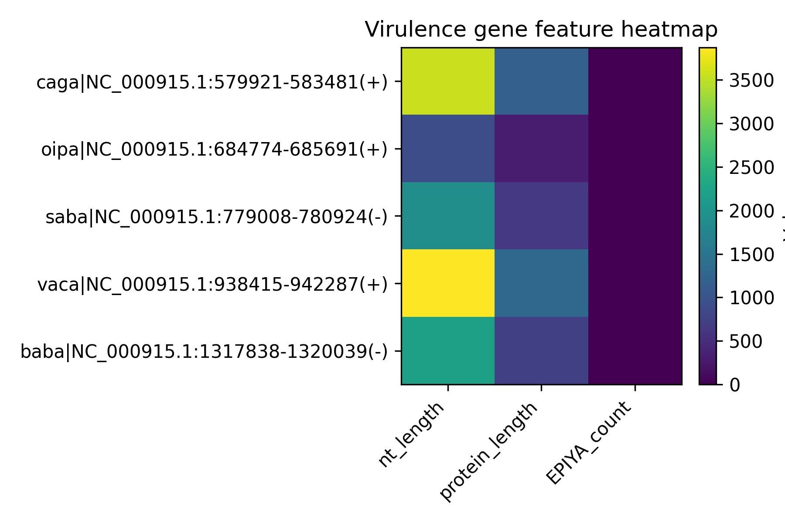
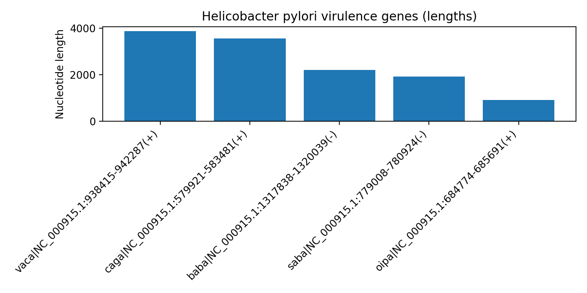
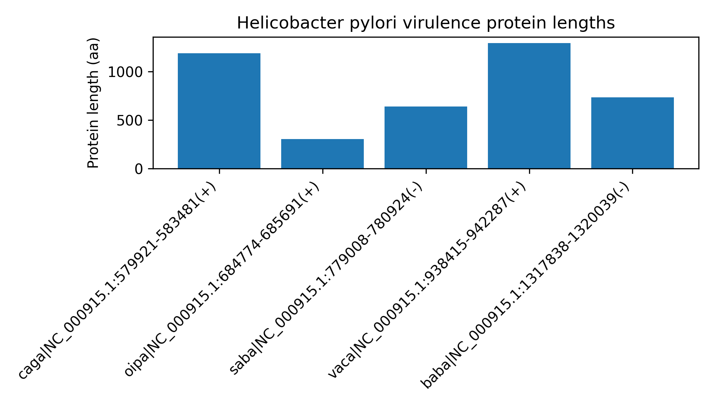
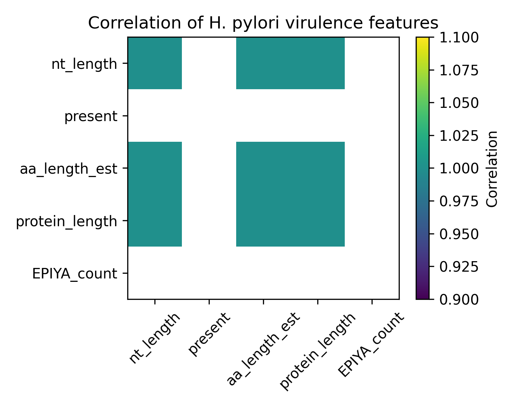

# Bioinformatics Analysis of Helicobacter pylori Virulence Factors

## Project Overview
This project presents a small bioinformatics and data science analysis of *Helicobacter pylori* virulence genes, with a particular focus on the **CagA protein** and its **EPIYA phosphorylation motifs**, which are key determinants of pathogenicity and gastric disease severity.

The workflow integrates sequence analysis, motif detection, data structuring, and visualization using Python and standard UNIX tools.

---

## Objectives
- Translate *H. pylori* virulence gene sequences into protein sequences
- Identify and locate EPIYA motifs within the CagA protein
- Extract flanking amino acid contexts around EPIYA motifs
- Quantify gene and protein lengths
- Visualize virulence features using plots and heatmaps

---

## Tools & Technologies
- Python 3
- Biopython
- Pandas
- Matplotlib
- UNIX command-line tools (grep, sed, wc)
- macOS Terminal

---

## Dataset
- *Helicobacter pylori* virulence gene sequences (FASTA format)
- Focus gene: **cagA**

---

## Workflow Summary

### 1. Sequence Translation
- The *cagA* nucleotide sequence was translated into a protein sequence.
- Protein length: **1186 amino acids**

### 2. EPIYA Motif Detection
- Two EPIYA motifs were identified in the C-terminal region of CagA.
- Motif positions and surrounding amino acid contexts were extracted.

### 3. Feature Extraction
The following features were quantified:
- Nucleotide length
- Estimated protein length
- EPIYA motif count

### 4. Data Visualization
- Bar plot of protein lengths for virulence genes
- Heatmap of virulence-associated features

---
Methods
1. Data Acquisition:
Genomic and virulence gene sequence data for Helicobacter pylori were obtained in FASTA format. The primary focus of the analysis was the cagA gene, a major virulence determinant associated with gastric inflammation and carcinogenesis. Genome annotation files (GFF format) were used to support gene-level feature extraction.
2. Sequence Processing and Translation:
The nucleotide sequence of the cagA gene was translated into its corresponding protein sequence using standard genetic code translation. Protein length was calculated to assess structural characteristics, with particular emphasis on the C-terminal region known to mediate host–pathogen interactions.
3. EPIYA Motif Identification:
EPIYA phosphorylation motifs within the CagA protein were identified using motif pattern matching. The positions of detected EPIYA motifs were recorded, and flanking amino acid sequences were extracted to capture the local biochemical context surrounding each motif. These motifs are critical for host cell signaling perturbation and pathogenicity.
4. Virulence Feature Extraction:
Quantitative features associated with virulence were computed, including:
Nucleotide sequence length
Protein sequence length
Number and positional distribution of EPIYA motifs
Extracted features were structured into tabular formats (TSV files) to enable downstream statistical analysis and visualization.
5. Statistical Analysis:
Descriptive statistics were calculated to summarize virulence feature distributions. Correlation analysis was performed to evaluate relationships between extracted features, allowing identification of coordinated or independent virulence-associated properties.
6. Data Visualization:
Visualization was performed using Python-based plotting libraries. The following graphical representations were generated:
Heatmaps to display virulence feature distributions and correlations
Bar plots to illustrate protein length characteristics
Distribution plots to summarize gene length variability
All figures were exported as high-resolution PNG files suitable for publication and repository display.
7. Computational Environment:
All analyses were conducted on macOS using the Terminal environment. The workflow integrated Python (version 3), Biopython for sequence manipulation, Pandas for data handling, and Matplotlib for visualization. Standard UNIX command-line utilities (e.g., grep, sed, wc) were used for lightweight preprocessing.
8. Reproducibility:
The complete analysis pipeline, including raw data, processed files, scripts, and figures, is publicly available via GitHub to ensure transparency and reproducibility.

## Results & Visualizations

### Virulence Feature Heatmap

Figure 1. Heatmap of H. pylori virulence-associated features.
Normalized virulence features derived from gene and protein sequences are visualized using a heatmap. Differences in color intensity highlight variation in feature abundance, allowing comparative assessment of virulence determinants across the dataset.
### Gene Length Distribution

Figure 2. Length distribution of H. pylori virulence genes.
The figure depicts the nucleotide length distribution of identified virulence genes, revealing heterogeneity in gene size that may reflect functional and evolutionary differences among virulence factor
### Protein Length Bar Plot

Figure 3. Protein length of the H. pylori CagA virulence factor.
The translated CagA protein length is visualized, emphasizing its extended structure. Such length variability is biologically significant, as the C-terminal region contains EPIYA motifs involved in host-cell signaling and pathogenicity.
### Feature Correlation Heatmap

Figure 4. Correlation matrix of virulence-associated features.
Pairwise correlations between quantified virulence features are shown. Strong correlations indicate interdependent biological properties, while weaker associations suggest distinct contributions to H. pylori pathogenicity.
## Key Results
- **CagA contains 2 EPIYA motifs**, consistent with highly virulent *H. pylori* strains.
- EPIYA motifs are clustered in the C-terminal region, supporting their role in host-cell signaling disruption.
- CagA is among the longest virulence-associated proteins analyzed.

---

## Output Files

### Figures (`figures/`)
- `protein_length_barplot.png`
- `virulence_feature_heatmap.png`
- `virulence_correlation.png`

### Tables (`tables/`)
- `virulence_numeric_matrix.tsv`
- `statistical_summary.tsv`

### Text Results (`results/`)
- `EPYIA_positions.txt`
- `EPYIA_context.txt`

---

## Biological Significance
EPIYA motifs in CagA undergo phosphorylation after host-cell entry, triggering aberrant signaling pathways linked to gastric inflammation, ulcers, and carcinoma. The number and positioning of EPIYA motifs are therefore critical virulence determinants.

---

## Conclusion
This project demonstrates how bioinformatics and data science techniques can be combined to extract biologically meaningful insights from bacterial genome sequences using lightweight computational workflows.

---

## Author
Dr Ali Ahmad
MBBS,
MSc Clinical & Molecular Microbiology, 
MSc Drug Discovery & Development  

